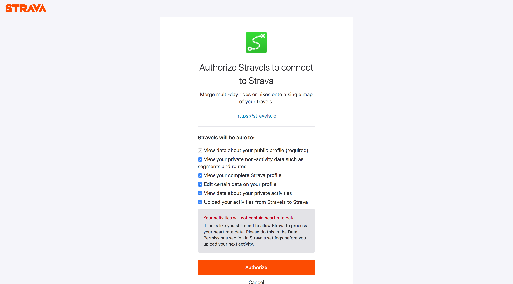

I use the Strava API to develop a little web app called
[Stravels](https://pwa.stravels.io).
It requires authentication tokens, which are obtained in the classic OAuth
flow way:

- Visit a login page on the provider's domain (Strava), passing the app ID.
- Log into the provider's system
- Arrive to the authorization page, where you can:
  - Authorize the whole app for the permissions it requested
  - Or a subset of permissions
  - Or deny the access altogether
- The page then redirects you to a URL with a query parameter containing a code.
- You must then do a token exchange by sending this code to the Strava API
  and they will give you a pair of tokens (refresh and access) in exchange.

Pfew, this is tedious !

## Tools against DRY

In order to play with the Strava API, I found myself having to build the login
page first in my prototypes, complete with handling the redirection.
This is not ideal, and it called for a better tool to obtain a token easily
to do quick API calls.

I recently started learning Rust, and was looking for something to build with
it. This sounds like the perfect excuse.

## What we're going to build

Here's what we want:

1. A command-line utility (no need for a web app or even a fancy UI)
2. That takes basic information as input
3. That lets you login and authorize the app
4. And gives you back the access and refresh tokens

## Let's go !

Point #1 gives us the development context: we need a Rust binary:

```shell
$ cargo init strava-auth --bin
$ cd strava-auth
```

_I'm not focusing on how to install Rust, what it is or how to use Cargo,
there's plenty of documentation out there already._

### Dependencies

We're going to need a few things to get started:

- A way to get information as command line arguments
- A way to open a URL into the default browser
- A way to start a web server on localhost
- A way to make HTTP requests (to the Strava API)

Fortunately, the [Rust ecosystem](https://crates.io) has everything we need:

```shell
$ cargo add structopt webbrowser rocket reqwest
```

_Note: to add dependencies this way, check out [`cargo-edit`](https://github.com/killercup/cargo-edit)._

Before going further, we're going to need to use the nightly version of Rust,
as required by Rocket (at the time of writing):

```shell
$ rustup override set nightly
```

Here's a recap:

- [`structopt`](https://crates.io/crates/structopt) handles CLI arguments parsing and validation
- [`webbrowser`](https://crates.io/crates/webbrowser) opens URLs in the default browser
- [`rocket`](https://crates.io/crates/rocket) is an awesome web server
- [`reqwest`](https://crates.io/crates/reqwest) sends HTTP requests

## Strategy

Before jumping into the code, here's what we're going to do:

1. Get the info we need from the command line
2. Build the authorization URL to open in the browser
3. Start a web server that listens on localhost for the redirection

According to the [Strava authentication documentation](https://developers.strava.com/docs/authentication/#request-access),
we need the client ID and secret, which can be found for our Strava
app [in the settings](https://www.strava.com/settings/api).

We'll pass the client ID and secret to our CLI like this:

```shell
$ strava-auth --id 123456 --secret 0123456789abcdef
```

## Command line arguments

Parsing command line arguments (and validating, and displaying help, and all
the extra perks of user interaction) is made easier with [`structopt`](https://docs.rs/structopt/):

```rust
// main.rs

#[macro_use]
extern crate structopt;

use structopt::StructOpt;

#[derive(StructOpt)]
#[structopt(name = "strava-auth")]
/// Authorize and authenticate a Strava API app.
///
/// Requires a GUI web browser to be available.
struct CliArgs {
  #[structopt(short = "i", long = "id")]
  client_id: u32,

  #[structopt(short = "s", long = "secret")]
  client_secret: String
}

fn main() {
  let cli_args = CliArgs::from_args();
  println!("{:#?}", cli_args);
}
```

Let's test it:

```shell
$ cargo run -- --id 123456 --secret 0123456789abcdef
```

_Note: the `--` after `cargo run` is to pass the arguments to our program and not to cargo itself. This is standard Unix stuff._

We should get the following output:

```shell
CliArgs {
    client_id: 123456,
    client_secret: "0123456789abcdef"
}
```

## Building the authorization URL

The specification for the url format is given by the [Strava authentication documentation](https://developers.strava.com/docs/authentication/#request-access).

We'll use the web version: `https://www.strava.com/oauth/authorize`.

By default we'll also request all the possible scopes, as we can manually
authorize them individually in the authorization page. As Strava sends us
back the approved scopes in the redirection URL, we'll display them as an
output to the user in addition to the tokens.

Now, for the `redirect_uri`, we'll use localhost as it's where our listening
server will be. Luckily, it's whitelisted by Strava (for local development),
so no need to mess with the OAuth redirection whitelist in your settings there.

Here's what the code looks like:

```rust
fn make_strava_auth_url(client_id: u32) -> String {
  let scopes = [
    // "read", // Shadowed by read_all
    "read_all",
    "profile:read_all",
    "profile:write",
    // "activity:read", // Shadowed by activity:read_all
    "activity:read_all",
    "activity:write",
  ]
  .join(",");

  let params = [
    format!("client_id={}", client_id),
    String::from("redirect_uri=http://localhost:8000"),
    String::from("response_type=code"),
    String::from("approval_prompt=auto"),
    format!("scope={}", scopes),
  ]
  .join("&");
  format!("https://www.strava.com/oauth/authorize?{}", params)
}
```

Now, let's use this function and pass it to [`webbrowser`](https://github.com/amodm/webbrowser-rs) to open it in the
default browser:

```rust
use webbrowser;

// ...

fn main() {
  let cli_args = CliArgs::from_args();

  let auth_url = make_strava_auth_url(cli_args.client_id);
  if webbrowser::open(&auth_url).is_err() {
    // Try manually
    println!("Visit the following URL to authorize your app with Strava:");
    println!("{}\n", auth_url);
  }
}
```

This is an example of how good error handling is in Rust: rather than calling
`.unwrap()` on the result of `webbrowser::open()` and crash if it did not
manage to find a suitable browser to open the URL in, provide a fallback by
showing it to the user and letting them open it manually.

Let's test what we've done so far.

```shell
$ cargo run -- --id <your-app-id> --secret <your-app-secret>
```

You should get something like this in your browser:



Now if you click either Authorize or Cancel, you'll get an error "Unable to
connect", as there is no server to listen to the redirect.

## Adding the server

Spinning a web server is very easy with [Rocket](https://rocket.rs).

We're going to define two routes, one for a successful redirection (which
contains a code and a list of approved scopes), and one for redirection
errors.

We'll also implement the server in a separate file `server.rs`, to keep
things tidy.

### Route definitions

Here's what our routes will look like:

```rust
// server.rs
use rocket::config::{Config, Environment, LoggingLevel};
use rocket::http::RawStr;

#[get("/?<code>&<scope>")]
fn success(code: &RawStr, scope: &RawStr) -> &'static str {
  println!("Code: {}", code);
  println!("Scope: {}", scope);
  "✅ You may close this browser tab and return to the terminal."
}

#[get("/?<error>", rank = 2)]
fn error(error: &RawStr) -> String {
  println!("{}", error);
  format!("Error: {}, please return to the terminal.", error)
}
```

In Rocket, routes that collide (here `/`) must provide a [ranking](https://rocket.rs/v0.4/guide/requests/#forwarding), which
defines in which order they will be tried.

Now if the redirect contains query parameters of `code` and `scopes`, the
first handler `success` will be called, otherwise an `error` query parameter
should be there, and the second handler `error` will be called.

If neither is present, then we'll get a 404 error (but we don't care since
the problem would be on Strava's side).

In both case, we print our parameters to the terminal, and return a string
as a response that will be visible in the browser, instructing the user to
return to the terminal.

### Starting the server

Let's add a function to `server.rs` to start the Rocket server:

```rust
pub fn start() {
  let config = Config::build(Environment::Development)
    .log_level(LoggingLevel::Off)
    .finalize()
    .unwrap();
  rocket::custom(config)
    .mount("/", routes![success, error])
    .launch();
}
```

Most of the complexity here is to create a custom configuration for Rocket
that suppresses logging to the console, as we don't care much for its
internals in this case.

Let's move back to `main.rs`:

```rust
// main.rs

// Required for Rocket code generation to work
#![feature(proc_macro_hygiene, decl_macro)]

#[macro_use]
extern crate rocket;

mod server; // Include our `server.rs` file

// ...

fn main() {
  let cli_args = CliArgs::from_args();
  let auth_url = make_strava_auth_url(cli_args.client_id);
  if webbrowser::open(&auth_url).is_err() {
    // Try manually
    println!("Visit the following URL to authorize your app with Strava:");
    println!("{}\n", auth_url);
  }

  server::start();
}
```

### A case for multithreading

By default, Rocket's `launch()` method will block the thread it's running on
to wait for requests, indefinitely, and never return.

This is not ideal, as we're going to have to continue doing stuff once the
redirection has succeeded (or failed), and moving that logic into the route
handlers would not be recommended: it would duplicate some logic, make the
whole program hard to reason about and the code even harder to read without
knowing the data flow.

Fortunately, Rust is great for multithreaded applications. So we're going to
start the web server in a separate thread, and have it communicate with the
main thread with an `mpsc` channel (there's many multithreading crates in the
ecosystem, but the standard library will do just fine here).

Since many things can happen that the server may want to report, we'll start
by defining some data structures to exchange:

```rust
// server.rs

#[derive(Debug)]
pub struct AuthInfo {
  pub code: String,
  pub scopes: Vec<String>,
}

impl AuthInfo {
  pub fn new(code: &RawStr, scopes: &RawStr) -> Self {
    Self {
      code: String::from(code.as_str()),
      scopes: scopes.as_str().split(",").map(String::from).collect(),
    }
  }
}
```

When everything goes well, the route handler will send an `AuthInfo` struct
back to the main thread, that contains the authorization code and the
approved scopes.

Still, we need a single type to send through the channel, and as things can
go wrong, let's use a classic Rust construct, `Result`:

```rust
pub type AuthResult = Result<AuthInfo, String>;
```

Our errors can be strings for now, as there's not much interest to strongly
type them at this point.

### Data-race freedom

---

                            Work in progress

---

You know how everyone says Rust is data-race free ? We're about to witness an
example.

Rocket uses multiple threads to parallelise request handling. Even though we
are only going to see a single request, Rust is here to let us know that
things could go wrong when passing data from the route handler back to the
main thread.

As we don't have a way to clone our `tx` when Rocket spawns its worker
threads, we're going to use a Mutex instead (performance is not a critical
feature here).

We're also going to reduce the number of worker threads to 1, even if it does
not magically bring back thread safety, it will at least avoid unnecessary
thread creation.

To pass the Mutex, we'll use Rocket's managed state facility.

Then make the request to Strava API for token exchange.
